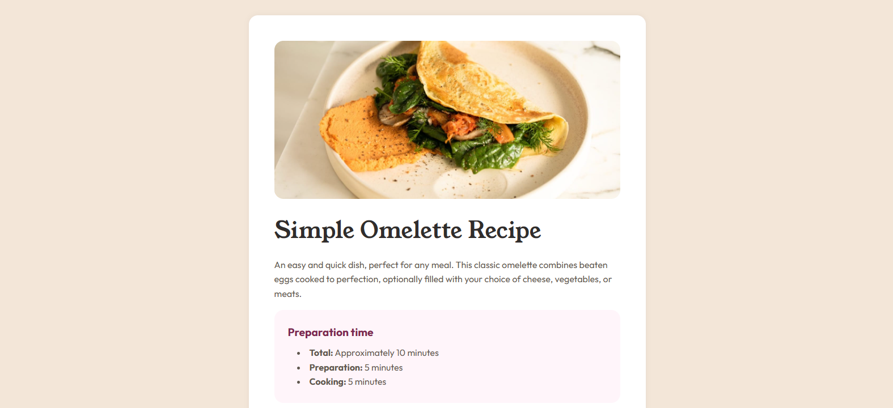

# Frontend Mentor - Recipe Page

Este é um projeto baseado no desafio [Recipe Page](https://www.frontendmentor.io/challenges/recipe-page-KiTsR8QQKm) do Frontend Mentor. O objetivo foi transformar um design estático em uma página responsiva, acessível e fiel ao layout proposto.

---

## 🛠️ Tecnologias Utilizadas

- HTML5 semântico
- CSS3 com variáveis (`custom properties`)
- Flexbox
- Design responsivo (mobile-first)
- Acessibilidade com `aria-label`

---

## 🎯 Objetivo

Praticar a criação de uma página estática com foco em tipografia, uso correto de espaçamento e cores, além de consolidar conhecimentos em responsividade e organização de código com CSS moderno.

---

## 📸 Screenshot / Captura de Tela

---

## 🔗 Links

- [🔗 Visualizar Projeto](https://marianaararipe.github.io/omelette-recipe-page/)
- [📂 Código no GitHub](https://github.com/marianaararipe/omelette-recipe-page)
- [📂 Repositório no Frontend Mentor](https://www.frontendmentor.io/solutions/omellete-recipe-page-htmlcss-rWlriFRjAw)

---

## 💡 O que aprendi

Durante o desenvolvimento desse projeto, aprendi e reforcei conhecimentos como:

- Como aplicar `aria-label` para melhorar acessibilidade
- Como aplicar estilos consistentes com variáveis CSS
- A importância da hierarquia tipográfica no design de interfaces
- Responsividade baseada em `max-width` e organização com Flexbox
- Uso de `
` para separar seções com estilo visual personalizado
- Como entregar um projeto limpo e acessível com HTML bem estruturado

---

## 📚 Recursos úteis

- [Guia do Flexbox - CSS Tricks](https://css-tricks.com/snippets/css/a-guide-to-flexbox/)
- [MDN Web Docs - Acessibilidade com ARIA](https://developer.mozilla.org/pt-BR/docs/Web/Accessibility/ARIA)
- [Guia de Semântica HTML - MDN](https://developer.mozilla.org/pt-BR/docs/Glossary/Semantics)
- [Guia de Acessibilidade com HTML - W3C](https://www.w3.org/WAI/tutorials/page-structure/)

---
## 👤 Autor

- GitHub: [@marianaararipe](https://github.com/marianaararipe)
- Frontend Mentor: [@marianaararipe](https://www.frontendmentor.io/profile/marianaararipe)
